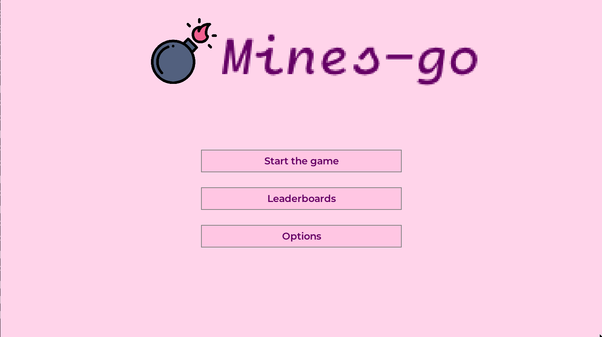
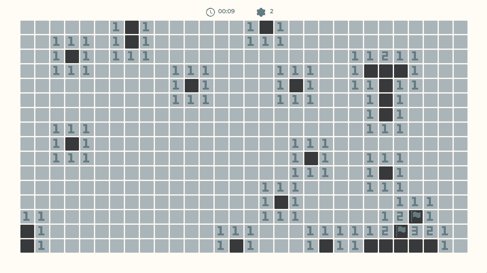
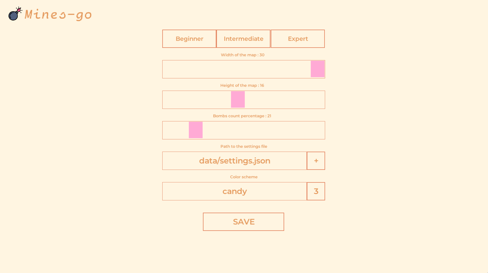
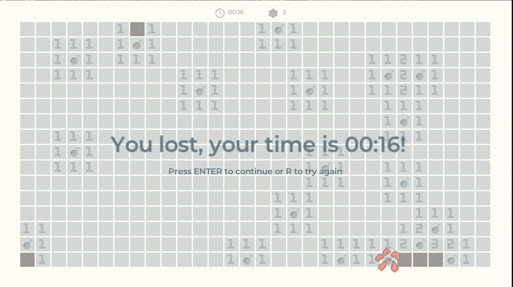
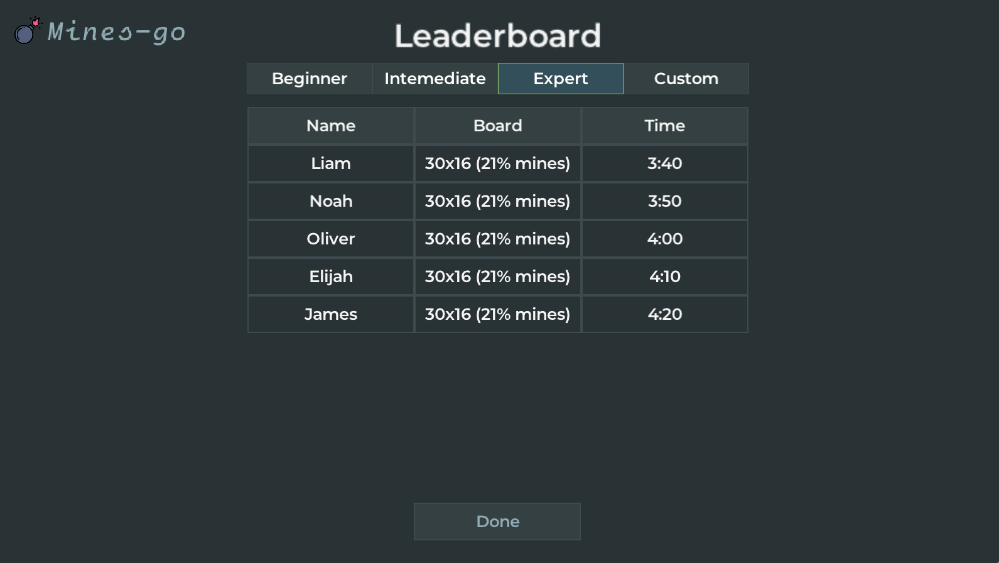

# 💣 Mines-go

👋 Hi! This is a small mines game written in golang. It uses a go port for a game library called [raylib-go](https://github.com/gen2brain/raylib-go). I created it to try out game development and **learn a new language** in the process! I also remade some of the features from [raygui](https://github.com/raysan5/raygui) to make the creating GUI widgets much **easier** and more **customizable**.

## 🧐 What are the features?

This mines game allows you to:

- Play mines! (obviously)
- Create your own board configurations
- Use and create **custom themes**!
- Make it to the scoreboard and try to get the best time on your favorite mines board

## ✨ Getting Started

### 1. Clone the repository

```sh
git clone --depth=1 https://github.com/TypicalAM/Mines-go/ && cd Mines-go
```

### 2. Build and run the program

```sh
go build -o main.go -o mines
```

### 3. Playing time!

```sh
./mines
```

And you're good to *go*!

## 📸 Product images

<p align="center">
    
</p>
<p align="center">
    
</p>
<p align="center">
    
</p>
<p align="center">
    
</p>
<p align="center">
    
</p>
